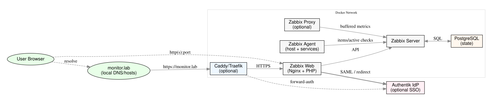

<p align=\"center\">

</p>

# Zabbix‑Docker — Production‑Ready Monitoring Stack 

A from‑scratch, containerized **Zabbix** stack with **PostgreSQL** and optional **reverse proxy** and **SSO**. Built to demonstrate platform engineering, secure design, and observability fundamentals in a real homelab using a `.lab` domain (e.g., `monitor.lab`).

---

## ✨ Highlights

- **Clean architecture**: Zabbix Server, Web, DB, Proxy (optional), Agent
- **Reproducible**: Docker Compose with env‑driven config and persistent volumes
- **Security‑minded**: TLS via Caddy/Traefik overlay, secrets outside Git, least privilege
- **Identity‑aware**: Optional **Authentik** SSO via **SAML** or **forward‑auth**
- **Portfolio‑grade**: Clear docs, scripts, and an operations checklist

---

## 🧭 Project Goals

Showcase the end‑to‑end journey of standing up an internal monitoring platform:
- Network/host/service visibility with Zabbix templates and agents
- Healthy container orchestration and stateful services on Docker
- Secure exposure with TLS and SSO (when enabled)
- Practical operations (backup/restore, diagnostics, troubleshooting)

---

## 🏗️ Architecture

See the dedicated doc and diagram:
<p align="center">
  
</p>

> Click below to view or download the PNG version:
>
> [📎 View PNG](docs/zabbix_architecture_public.png)

The diagram illustrates how each service interacts within the Docker network,
including optional integrations with Authentik for SSO and Caddy/Traefik for TLS termination.

---

## 🧰 Tech Stack

- **Zabbix** (Server, Web, Proxy, Agent)
- **PostgreSQL** (primary datastore)
- **Docker Compose v2**
- **Caddy** or **Traefik** *(optional)* for TLS + pretty URL (`https://monitor.lab`)
- **Authentik** *(optional)* for SSO (SAML or forward‑auth patterns)

---

## ⚙️ Prerequisites

- Linux host with Docker Engine 24+ and Docker Compose v2
- Local DNS/hosts entry for `monitor.lab` → Docker host IP
- (Optional) TLS certificates or ACME DNS for your `.lab` domain
- `git` and Graphviz (`dot`) if you want to render the diagram

---

## 🚀 Quick Start

```bash
git clone https://github.com/dj-3dub/Zabbix-Docker.git
cd Zabbix-Docker

# Copy and tailor environment files
cp .env.example .env
# edit DOMAIN=monitor.lab and strong passwords

# Bring up the base stack (no proxy, direct ports)
docker compose up -d

# Visit the UI on the published port or behind your proxy of choice
# Optional: enable Caddy/Traefik overlay compose for TLS + pretty URL
```

## 🔐 Optional: TLS + Reverse Proxy

- **Caddy overlay**: automatic HTTPS, minimal config
- **Traefik overlay**: Docker label routing, middlewares, mTLS, dashboards

---

## 🔑 Optional: Authentik SSO

Two supported patterns:

**SAML (recommended, no proxy required)**  
Authentik as **IdP**, Zabbix as **SP**. In Zabbix → Administration → Authentication → SAML:
- ACS URL: `https://monitor.lab/index_sso.php`
- SP Entity ID: `urn:monitor.lab:zabbix`
- Map attributes: `mail` (username), `givenName`, `sn`, and optional `groups`
- Keep local **Admin** password for break‑glass access

**Forward‑Auth at Proxy (requires Caddy/Traefik)**  
Protect the route with an Authentik outpost, pass identity headers, set Zabbix Authentication to **HTTP** (web‑server) and map header (e.g., `X-Forwarded-User`).

See **docs/ARCHITECTURE.md** for diagrams and steps.

---

## 🧪 Diagnostics

- `scripts/zbxdiag.sh` — quick API sanity: login/auth, version, host lookup
- Container healthchecks for Server/Web/DB
- Suggested item/triggers for self‑monitoring Zabbix itself

---

## 🗃️ Backup & Restore

- Nightly `pg_dump` to `/backups` via helper script
- Store off‑box (NAS/S3/Restic). To restore, stop Zabbix Server, restore DB, start stack

---

## 🔐 Security Notes

- Enforce HTTPS when exposed; restrict HTTP
- Store secrets in `.env` / Docker secrets; **never** commit real credentials
- Limit container privileges and networks
- Set strong DB/Zabbix passwords and rotate routinely

---

## 🛣️ Roadmap

- Grafana dashboards via Zabbix data source (read‑only)
- CI/CD: compose lint + shellcheck + smoke API test
- Terraform module to provision host + DNS
- HA notes for Zabbix Server and DB

---

## 👤 About

Built by **Tim Heverin** (dj‑3dub).  
- GitHub: https://github.com/dj-3dub  
- LinkedIn: https://www.linkedin.com/in/tim-heverin/

MIT License.
